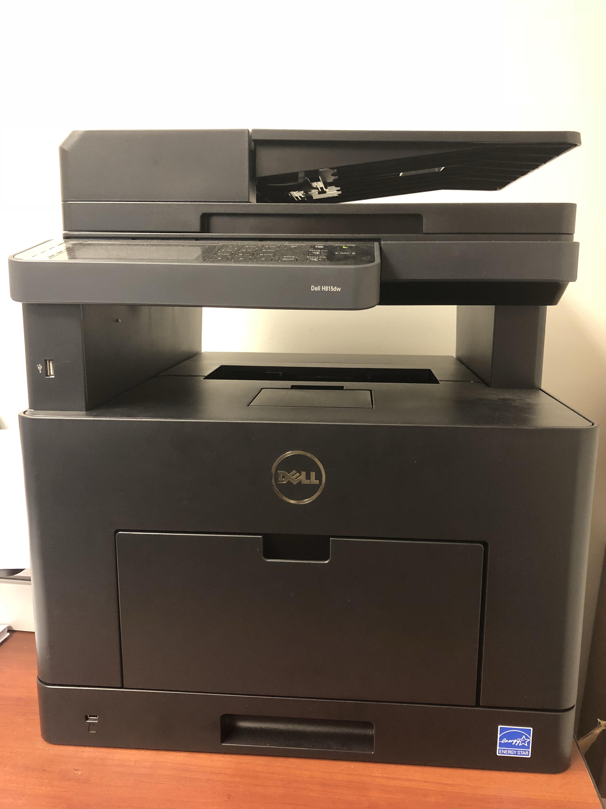
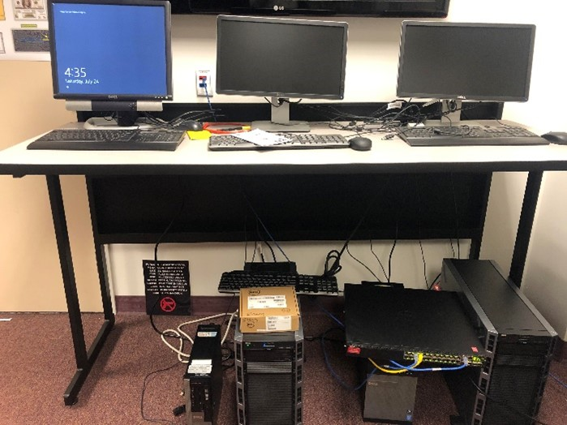
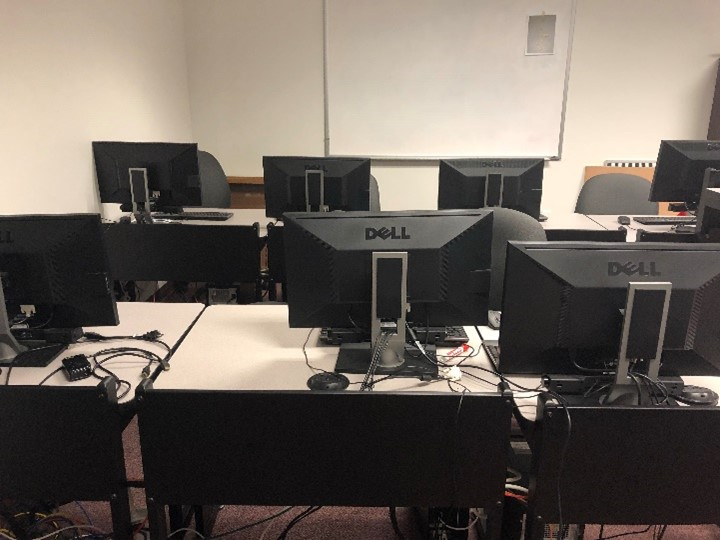
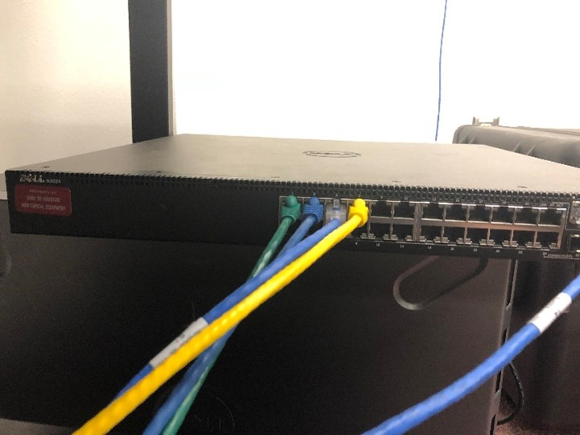

---
title: Home
layout: default
filename: index
--- 

The Network, Software and System Laboratory is currently located at the Room 228D of Technology Building 2 at the University of Houston. Beyond the research, the lab also serves as an education center for training future network, software, and system scientists. The lab is equipped with high performance server, network devices and workstations for the tasks of model building, trust management algorithms analysis and simulation, evaluations, and testing, etc.

                        
